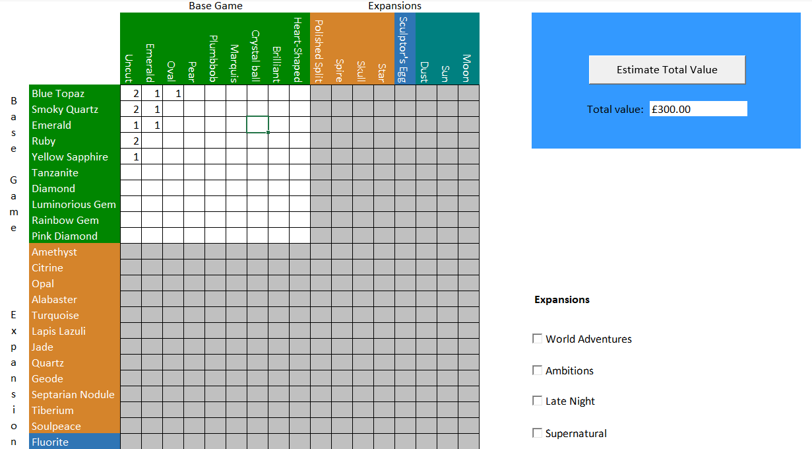

# Asset Valuation - Sims 3
The Sims 3 had gems you could cut into various shapes and metals you could smelt. Rare gems and unusual cuts were worth more. This is a spreadsheet to calculate the total value of your gems and metals depending on how many of each you have.
## Instructions
Input the numbers of gems and metals into the boxes provided. Click "Estimate Total Value" to calculate the value estimation.
## Example

